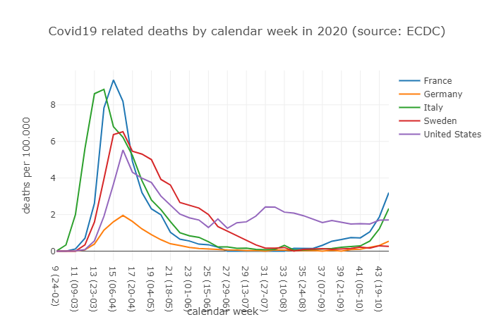
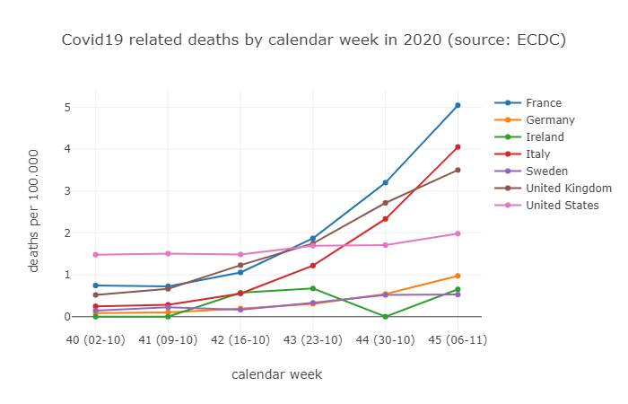

# Covid19 related deaths plot

This package uses the data from the _European Centre for Disease Prevention and Control_ ([ECDC](https://www.ecdc.europa.eu/publications-data/data-national-14-day-notification-rate-covid-19)) to display a plot of the number deaths (by 100.000 of population) related to Covid19 by country.

## Usage

1. Install [Node.js](nodejs.org) if it is not already installed
2. Download the ECDC data from https://opendata.ecdc.europa.eu/covid19/nationalcasedeath/json and save it in the project folder as `ecdc-report.json`
3. Run `npm install` to install dependencies
4. Run `npm start`
5. A browser opens with the interactive plot

## Config

Some settings can be adapted be changing the values in the `config.ts` file.
| Config      | Description                                                                                 |
|-------------|---------------------------------------------------------------------------------------------|
| `startWeek` | First week of the year that is plotted                                                      |
| `countries` | For every country in this array a line is added to the plot (see below for possible values) |

## Data

Every record in the data from ECDC has a `source` entry.
The data contains reports from the following countries (not all of them may acutally be filled):

  
Click to expand list

| Code | Country |
|------|---------|
| AFG | Afghanistan |
| ALB | Albania |
| DZA | Algeria |
| AND | Andorra |
| AGO | Angola |
| AIA | Anguilla |
| ATG | Antigua and Barbuda |
| ARG | Argentina |
| ARM | Armenia |
| ABW | Aruba |
| AUS | Australia |
| AUT | Austria |
| AZE | Azerbaijan |
| BHS | Bahamas |
| BHR | Bahrain |
| BGD | Bangladesh |
| BRB | Barbados |
| BLR | Belarus |
| BEL | Belgium |
| BLZ | Belize |
| BEN | Benin |
| BMU | Bermuda |
| BTN | Bhutan |
| BOL | Bolivia |
| BES | Bonaire, Saint Eustatius and Saba |
| BIH | Bosnia and Herzegovina |
| BWA | Botswana |
| BRA | Brazil |
| VGB | British Virgin Islands |
| BRN | Brunei |
| BGR | Bulgaria |
| BFA | Burkina Faso |
| BDI | Burundi |
| CPV | Cabo Verde |
| KHM | Cambodia |
| CMR | Cameroon |
| CAN | Canada |
| CYM | Cayman Islands |
| CAF | Central African Republic |
| TCD | Chad |
| CHL | Chile |
| CHN | China |
| COL | Colombia |
| COM | Comoros |
| COG | Congo |
| CRI | Costa Rica |
| CIV | Côte d’Ivoire |
| HRV | Croatia |
| CUB | Cuba |
| CUW | Curaçao |
| CYP | Cyprus |
| CZE | Czechia |
| COD | Democratic Republic of the Congo |
| DNK | Denmark |
| DJI | Djibouti |
| DMA | Dominica |
| DOM | Dominican Republic |
| ECU | Ecuador |
| EGY | Egypt |
| SLV | El Salvador |
| GNQ | Equatorial Guinea |
| ERI | Eritrea |
| EST | Estonia |
| SWZ | Eswatini |
| ETH | Ethiopia |
| FLK | Falkland Islands |
| FRO | Faroes |
| FJI | Fiji |
| FIN | Finland |
| FRA | France |
| PYF | French Polynesia |
| GAB | Gabon |
| GEO | Georgia |
| DEU | Germany |
| GHA | Ghana |
| GIB | Gibraltar |
| GRC | Greece |
| GRL | Greenland |
| GRD | Grenada |
| GUM | Guam |
| GTM | Guatemala |
| GGY | Guernsey |
| GIN | Guinea |
| GNB | Guinea-Bissau |
| GUY | Guyana |
| HTI | Haiti |
| HND | Honduras |
| HUN | Hungary |
| ISL | Iceland |
| IND | India |
| IDN | Indonesia |
| IRN | Iran |
| IRQ | Iraq |
| IRL | Ireland |
| IMN | Isle of Man |
| ISR | Israel |
| ITA | Italy |
| JAM | Jamaica |
| JPN | Japan |
| JEY | Jersey |
| JOR | Jordan |
| KAZ | Kazakhstan |
| KEN | Kenya |
| RKS | Kosovo |
| KWT | Kuwait |
| KGZ | Kyrgyzstan |
| LAO | Laos |
| LVA | Latvia |
| LBN | Lebanon |
| LSO | Lesotho |
| LBR | Liberia |
| LBY | Libya |
| LIE | Liechtenstein |
| LTU | Lithuania |
| LUX | Luxembourg |
| MDG | Madagascar |
| MWI | Malawi |
| MYS | Malaysia |
| MDV | Maldives |
| MLI | Mali |
| MLT | Malta |
| MHL | Marshall Islands |
| MRT | Mauritania |
| MUS | Mauritius |
| MEX | Mexico |
| MDA | Moldova |
| MCO | Monaco |
| MNG | Mongolia |
| MNE | Montenegro |
| MSR | Montserrat |
| MAR | Morocco |
| MOZ | Mozambique |
| MMR | Myanmar/Burma |
| NAM | Namibia |
| NPL | Nepal |
| NLD | Netherlands |
| NCL | New Caledonia |
| NZL | New Zealand |
| NIC | Nicaragua |
| NER | Niger |
| NGA | Nigeria |
| MKD | North Macedonia |
| MNP | Northern Mariana Islands |
| NOR | Norway |
| OMN | Oman |
| PAK | Pakistan |
| PSE | Palestine |
| PAN | Panama |
| PNG | Papua New Guinea |
| PRY | Paraguay |
| PER | Peru |
| PHL | Philippines |
| POL | Poland |
| PRT | Portugal |
| PRI | Puerto Rico |
| QAT | Qatar |
| ROU | Romania |
| RUS | Russia |
| RWA | Rwanda |
| KNA | Saint Kitts and Nevis |
| LCA | Saint Lucia |
| VCT | Saint Vincent and the Grenadines |
| SMR | San Marino |
| STP | São Tomé and Príncipe |
| SAU | Saudi Arabia |
| SEN | Senegal |
| SRB | Serbia |
| SYC | Seychelles |
| SLE | Sierra Leone |
| SGP | Singapore |
| SXM | Sint Maarten |
| SVK | Slovakia |
| SVN | Slovenia |
| SLB | Solomon Islands |
| SOM | Somalia |
| ZAF | South Africa |
| KOR | South Korea |
| SSD | South Sudan |
| ESP | Spain |
| LKA | Sri Lanka |
| SDN | Sudan |
| SUR | Suriname |
| SWE | Sweden |
| CHE | Switzerland |
| SYR | Syria |
| TWN | Taiwan |
| TJK | Tajikistan |
| TZA | Tanzania |
| THA | Thailand |
| GMB | The Gambia |
| VAT | the Holy See/ Vatican City State |
| TLS | Timor-Leste |
| TGO | Togo |
| TTO | Trinidad and Tobago |
| TUN | Tunisia |
| TUR | Turkey |
| TCA | Turks and Caicos Islands |
| UGA | Uganda |
| UKR | Ukraine |
| ARE | United Arab Emirates |
| GBR | United Kingdom |
| USA | United States |
| URY | Uruguay |
| VIR | US Virgin Islands |
| UZB | Uzbekistan |
| VEN | Venezuela |
| VNM | Vietnam |
| WLF | Wallis and Futuna |
| ESH | Western Sahara |
| YEM | Yemen |
| ZMB | Zambia |
| ZWE | Zimbabwe |

## Based on

The plot is easily created using [Nodeplotlib](https://github.com/ngfelixl/nodeplotlib) by [Felix Lemke](https://github.com/ngfelixl) 🙏

## License

> Copyright 2020 Daniel Fader
> 
> Permission to use, copy, modify, and/or distribute this software for any purpose with or without fee is hereby granted, provided that the above copyright notice and this permission notice appear in all copies.
>
>THE SOFTWARE IS PROVIDED "AS IS" AND THE AUTHOR DISCLAIMS ALL WARRANTIES WITH REGARD TO THIS SOFTWARE INCLUDING ALL IMPLIED WARRANTIES OF MERCHANTABILITY AND FITNESS. IN NO EVENT SHALL THE AUTHOR BE LIABLE FOR ANY SPECIAL, DIRECT, INDIRECT, OR CONSEQUENTIAL DAMAGES OR ANY DAMAGES WHATSOEVER RESULTING FROM LOSS OF USE, DATA OR PROFITS, WHETHER IN AN ACTION OF CONTRACT, NEGLIGENCE OR OTHER TORTIOUS ACTION, ARISING OUT OF OR IN CONNECTION WITH THE USE OR PERFORMANCE OF THIS SOFTWARE.
